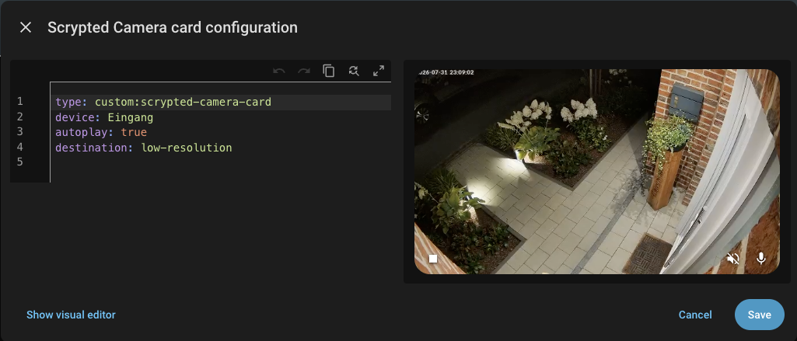

# Scrypted Camera Card

Lovelace card that streams a Scrypted camera over WebRTC directly, with two-way
audio. No iframe, no Scrypted console, no CSS injection, no scraped selectors.



## Before you install: how the card reaches Scrypted

The card never talks to Scrypted directly — a browser is not allowed to, see _Why there is
no `base_url`_ below. It goes through Home Assistant, and **it picks how by itself**:

> The card uses the [`koush/ha_scrypted`](https://github.com/koush/ha_scrypted) integration's
> proxy when that integration is installed. Otherwise the Scrypted **add-on**. If you set
> Scrypted `username`/`password`, always the add-on — that is the only route where they mean
> anything. If the proxy is installed but cannot be resolved, the add-on is tried anyway
> before the card gives up.

So one of these has to be true, and there is nothing to configure for either:

- **Scrypted as a Home Assistant add-on**, on a **Supervised or Home Assistant OS** install.
  The card asks the Supervisor for an ingress session over the websocket Home Assistant
  already authenticated, so no token or password ends up in your dashboard.
- **or the `koush/ha_scrypted` integration** installed through HACS and pointed at your
  Scrypted — which can be anywhere: its own container, a NAS, another host. This also works
  on **HA Container and HA Core**, which have no Supervisor. The cost: everything the card
  sees goes through the account that integration is configured with, so `username` /
  `password` are refused on this route — see _Card config_.

The card shows which route it took next to the version number, bottom right, while it is
paused: `v0.5.0 · integration` or `· ingress`.

**Administrator rights are *not* required** on either route. They used to be, and this is the
point people carry over from older versions: the card no longer asks Home Assistant for the
list of installed add-ons, which was the only admin-gated call it made.

Tested against Scrypted 0.143.0. Scrypted's RPC and `RTCSignalingSession` are
internal interfaces rather than a documented public API, so a Scrypted update can
break this card. See _Known risks_ at the end.

## Install

### HACS (recommended)

Not in the default HACS store yet, so add it as a custom repository: HACS →
three-dot menu → **Custom repositories** → this repository's URL, category
**Dashboard**. Then install "Scrypted Camera Card" and reload the browser.

On a **storage-mode** dashboard — the default, edited through the UI — HACS registers
the Lovelace resource itself and there is nothing to add under Settings → Dashboards →
Resources.

On a **YAML-mode** dashboard HACS cannot register resources at all, so add it yourself
in `configuration.yaml`:

```yaml
lovelace:
  mode: yaml
  resources:
    - url: /hacsfiles/scrypted-camera-card/scrypted-camera-card.js?v=0.1.0
      type: module
```

Note the `?v=`. HACS appends its own cache-busting query when it registers a resource,
and a hand-written entry gets none — so without it a browser or the Home Assistant
service worker will keep serving the previous bundle after a HACS update, which looks
exactly like the update not having worked. Bump the value whenever you update.

**To check which version a dashboard is actually running**, look at the top right corner
of the card while it is not streaming: the version is printed there. That is the quickest
way to tell a failed update from a cached one.

### Manual

Build it yourself (see _Build_) or take `scrypted-camera-card.js` from a release,
then:

```sh
cp scrypted-camera-card.js <config>/www/
```

and register it once under Settings → Dashboards → Resources as a **JavaScript
module** pointing at `/local/scrypted-camera-card.js`. Note that this path has no
version in it, so a browser or the HA service worker will happily keep serving an
old copy after an update — append a `?v=` query and change it whenever you replace
the file.

## How it works

1. Resolves a base URL on the Home Assistant origin. On the **ingress** route that is a
   Supervisor ingress session obtained over the **existing authenticated HA websocket**
   (`hass.callWS`), so no access token goes into the dashboard config. On the
   **integration** route it is the proxy path the `koush/ha_scrypted` integration publishes
   on its sidebar panel, re-read on every connect because the token in it changes whenever
   that integration reloads.
2. Connects `@scrypted/client` against that base URL. Both routes answer `/login` with an
   authorization without being given credentials — the add-on authenticates the ingress
   user, the proxy authenticates server-side — so no Scrypted credentials are needed either.
3. Implements `RTCSignalingSession` in the browser (`src/signaling.js`) and hands
   it to `device.startRTCSignalingSession()`. The plugin drives the exchange.
4. Attaches the resulting stream to a plain `<video>`.
5. Talkback: the audio transceiver is negotiated as `sendrecv` when the camera
   exposes `Intercom`, but carries no track until the mic button is pressed.
   That way no microphone prompt appears just from viewing.

## Build

```sh
npm install
npm run build
```

Produces `dist/scrypted-camera-card.js` (~167 kb). `npm run watch` rebuilds on
change with a sourcemap. `dist/` is not tracked in git — releases carry the bundle
as an asset, built by `.github/workflows/release.yml`.

Bundling goes through `build.mjs` rather than plain esbuild flags, for two
reasons that are not optional:

1. `@scrypted/client` has no `browser` field and no `exports` map, so esbuild
   resolves its Node paths and pulls in `events`, `net`, `stream` and
   `follow-redirects`. Those are stubbed - none of them is on a code path a
   browser executes.
2. The package selects its HTTP implementation by *trying* to require those
   builtins and falling back to `fetch` when the require throws. Stubbing alone
   would make the require succeed and thus select the Node path, which then
   fails at runtime. `define: { 'process.arch': '"browser"' }` is the package's
   own browser switch and forces the correct branch. Verified in the output:
   `try{throw new Error}catch{ot=Ka.domFetch}`.

The stub plugin prints what it neutralised on every build. If that list grows
after a dependency update, check the new entry before assuming it is harmless.

To use a self-built bundle, follow _Manual_ under _Install_.

## Releasing

`hacs.json` names the file HACS looks for, and it must match the release asset
exactly. Cutting a release:

1. Bump `version` in `package.json` and add a `CHANGELOG.md` entry under a heading
   for the new version. The workflow takes the **topmost** `## ` section as the release
   notes, so the new version has to be at the top — an empty `[Unreleased]` heading
   above it would be picked instead, and the release would fall back to generated
   notes.
2. Tag and push, e.g. `git tag v0.2.0 && git push origin v0.2.0`. That is all —
   do **not** create the release by hand.
3. `.github/workflows/release.yml` builds the bundle and then creates the release
   with `scrypted-camera-card.js` attached.

The order matters. The release is created *last*, so a failed build publishes nothing
instead of leaving a release without its asset — which is what HACS would install as
broken. The bundle is deliberately not committed for the same reason: there is no stale
copy that could be shipped in place of a fresh one.

## Card config

```yaml
type: custom:scrypted-camera-card
device: "121"          # Scrypted device id (as in /#/device/121) or its name
name: Eingang          # optional, shown in the control bar
aspect_ratio: 16 / 9   # optional, any CSS aspect-ratio value
autoplay: false        # optional, default false - see below
# destination: low-resolution  # optional, see below
# source: Scrypted           # optional - only when the default does not fit, see below
# username / password        # add-on route only, see below
```

**`source`** names the add-on or the integration entry, and **you normally leave it empty.**
There is no option for the route: the card decides that by the rule in _Before you install_,
and `source` is then read by whichever route it chose.

Empty means "the obvious one": the only `koush/ha_scrypted` entry, or the add-on's usual slug
`09e60fb6_scrypted`. Set it when that is not enough:

- on the integration route it is that entry's **Name** — *not* the host, which is what Home
  Assistant shows as the entry's title in its integrations list. The Name defaults to
  `Scrypted` for every entry, so if you have two, rename one first; two entries with the same
  name cannot be told apart by this card.
- on the add-on route it is the add-on slug, for the rare install whose slug differs.

`username` / `password` are **refused** on the integration route, and that is deliberate
rather than an omission: the proxy replaces the authorization header on every request with the
integration's own, so credentials on the card would look like they scope it and scope nothing.
Setting them is therefore also what pins a card to the add-on route.

**Upgrading from 0.4.x or earlier — this one breaks configs.** `addon`, `connection` and
`integration_title` are gone with no alias. If your `addon` was the default slug or unset,
there is nothing to do. If you had set it to something else, **rename the key to `source`** —
otherwise the card looks for the default add-on and reports that it cannot read it. `connection`
and `integration_title` are simply ignored. Opening the card once in the visual editor removes
all three from the YAML.

**`autoplay`** decides only whether the card starts streaming when it first
loads. Default `false`: the card connects to Scrypted, shows a still image and
waits for the play button. Set it to `true` to stream immediately, which is how
the card behaved before this option was documented.

It deliberately does *not* govern anything after the first load. Once a stream
has been started - by autoplay or by the button - the card keeps trying to hold
it, and self-healing resumes it after an add-on restart, a dropped websocket or a
network outage regardless of this setting. Pressing stop is what revokes that
intent.

**`username` / `password`** are optional, apply to the **ingress** route only, and do two
different things depending on why you set them.

Left empty, the card connects as whoever the Scrypted add-on decides an ingress
request is — usually an account with full access. Filled in, the card authenticates
as that Scrypted user instead, so a viewer account restricted to a few cameras limits
what the card can show. That is the reason to use them, and the setup worth having if
other people in the household see this dashboard.

Two things to know before you do:

- **The dashboard configuration is not a secret store.** Any logged-in Home Assistant
  user can read it over the websocket API, so treat these as credentials for a
  restricted viewer account and nothing more.
- **They do not restrict Scrypted itself.** They scope what this card displays. A Home
  Assistant user who can load the card can also open Scrypted's own interface through
  the ingress URL, whatever the card authenticated as. See _Known risks_.

### Why there is no `base_url`

Pointing the card straight at `https://scrypted.local:10443` looks like the obvious option and
is not possible from a dashboard. Measured, not assumed: Scrypted answers the CORS preflight
**without** an `Access-Control-Allow-Origin` header, so the browser drops the request before it
is sent — and `@scrypted/client` hardcodes `withCredentials: true`, which puts every request in
the credentialed mode where even a wildcard would be rejected. Nothing in a card can change
either half.

Both supported routes exist to avoid that: they end at a URL on the Home Assistant origin, so
there is no cross-origin request at all. If you already run a reverse proxy in front of Home
Assistant, serving Scrypted under a path on the *same* origin would work for the same reason —
that is not implemented as an option here, and the integration route covers it without asking
you to configure anything.

**`destination`** picks which of the camera's streams to pull. Accepted values are
`local`, `remote` and `low-resolution` — the same names Scrypted offers in its own
stream picker. Omit it and Scrypted decides, which is that picker's `Default`.

Three things worth knowing before you set it:

- It is a **hint**, not an instruction. Scrypted's own documentation says the value
  "may be used as a hint to determine which main/substream to send". A camera with
  no matching substream will return a different stream, and nothing will announce
  that — check the camera's log in Scrypted if you want to know what it actually
  sent.
- Setting it **forces the WebRTC plugin's proxy path**. Without it, a camera that
  speaks WebRTC natively is passed straight through; with it, the card always goes
  through the plugin.
- The card refuses to stream on two conditions rather than pretending: an
  unrecognised value, and a camera that offers no selectable stream at all (only
  the WebRTC plugin's own synthetic one). Both put the reason on screen. Remove the
  option in that case.

## What this fixes over the iframe approach

- **Lifecycle.** `disconnectedCallback()` ends the RTC session, which releases the
  camera's talkback channel and stops the stream. An `IntersectionObserver` plus
  `visibilitychange` pauses the `<video>` element while the card is off screen.
  Both were impossible from inside an iframe.
  Note what this does *not* do: it saves no bandwidth. The WebRTC plugin's
  `setPlayback` ignores its `video` flag entirely, so the camera keeps sending
  while the card is off screen and only local playback pauses. Keeping the session
  alive is deliberate - coming back to a visible card is then instant instead of a
  fresh negotiation.
- **Session refresh.** `getRefreshAt()` / `extendSession()` keep long-running
  sessions alive, and the ingress session is revalidated every 5 minutes.
  Both were silent death causes before.
- **No permissions delegation.** The card runs in HA's own origin, so the
  microphone needs no `allow` attribute chain through two iframes.
- **No scraped selectors.** Nothing breaks when Scrypted changes its Vuetify
  class names.

## Known risks

**Bundling.** Solved, see Build - but fragile by nature. It relies on
`process.arch` still being Scrypted's browser switch and on the stub list
covering everything Node-only. A `@scrypted/client` update can change either.

**Unstable API.** Scrypted's RPC and `RTCSignalingSession` are internal
interfaces, not a documented public API. They can change between Scrypted
releases. The upside over the old approach: a break shows up as a missing method
rather than as silently mis-styled DOM.

**The visual editor's form.** The config dialog is drawn with `ha-form`, Home
Assistant's own form element. It is an internal component with no compatibility
promise — the same class of dependency as Scrypted's RPC above — and a future HA
release can change or remove it. Only the visual editor is affected: if it fails to
load, the dialog says so and the card is still configurable in YAML, which stays the
supported path.

**Talkback availability.** The mic button only appears when the plugin negotiates
`sendrecv` audio, which requires the camera to expose `Intercom`. If it stays
hidden, check the camera in Scrypted for the Intercom interface.

**A Home Assistant account is effectively Scrypted access.** Creating an ingress
session is not admin-gated, so any logged-in Home Assistant user can open Scrypted's
full interface at its ingress URL — with this card, or with two lines in a browser
console and no card at all. The card uses that door rather than opening it, and
nothing it can do would close it. If someone should not reach Scrypted, that boundary
belongs in Scrypted's own user management, or in not giving them a Home Assistant
account — a dashboard card cannot enforce it.

**The integration route depends on another project.** It relies on `koush/ha_scrypted` keeping
its proxy at `/api/scrypted/<token>/` and publishing it on its sidebar panel. That is a
third-party repository this card does not control, so a change there breaks this route — the
add-on route is unaffected, the card falls back to it when the proxy cannot be resolved, and
the error messages name the integration so it is clear whose contract broke.

Two properties of that route to know before choosing it: everything goes through the account
the integration is configured with, so per-card scoping via `username` / `password` is not
available; and the proxy view requires no Home Assistant authentication and carries its
bearer token in the URL path, so it is a second instance of the risk above rather than an
additional protection.

**Verify first.** `getDeviceById` / `getDeviceByName` and the exact
`connectScryptedClient` option set were taken from the current Scrypted sources.
Confirm against the version you run (0.143.0 here) before assuming a bug is in
this card.
